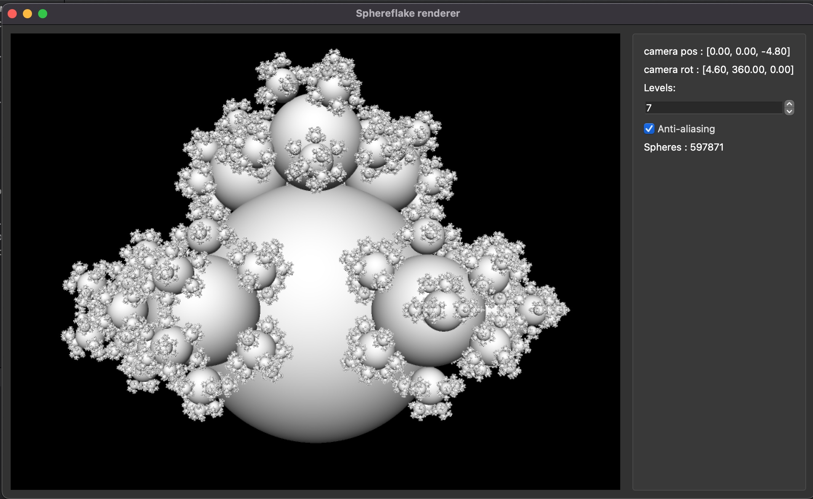

# 3dspheres

Basic 3dspheres ray tracer using a bounding volume hierarchy (BVH) tree structure.

The scene is generated recursively. For the initial stage we use a single sphere. Every other stage is generated by getting all the spheres from the previous stage and adding 6 across the equator and 3 at the top. The number of stages to render is configurable through the UI.

The spheres are put in a BVH for efficient ray tracing. 

Use the arrow keys to move the camera around. 

Can be successfully built with qt5.

